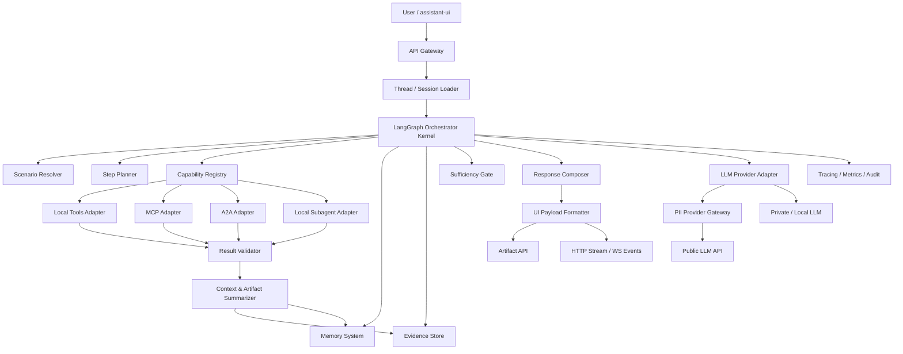
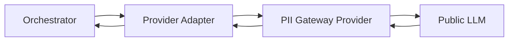
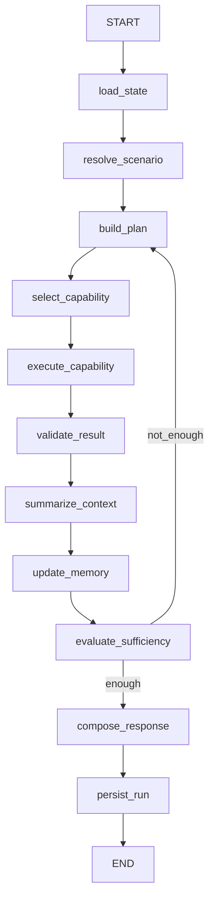

# Orchestrator Kernel на LangGraph: архитектура, подмодули, технологии и схема реализации

## 1. Цель модуля

Построить **мощный и надёжный оркестратор** как сердце продукта, который:

- управляет сценариями выполнения;
- накапливает достаточный контекст для ответа;
- подключает любые совместимые **Tools / MCP / A2A / локальные подагенты** без переписывания ядра;
- умеет работать с памятью, суммаризацией и артефактами;
- завершает цикл по формальному критерию **достаточности информации**;
- отдаёт результат в минимальный UI на базе **assistant-ui** через JSON/HTTP/WebSocket.

---

## 2. Обновлённые архитектурные допущения

### 2.1. PII-фильтр не часть оркестратора
PII-маскирование следует ставить как **отдельного provider-gateway**, через которого проходит весь outbound-трафик к публичным LLM.

Это означает:

- оркестратор не занимается замаскировать/размаскировать внутри своих нод;
- оркестратор обращается к **LLM Provider Adapter**;
- этот adapter может быть:
  - `direct_provider_adapter` для приватной/локальной модели;
  - `pii_gateway_provider_adapter` для публичной LLM через внешний proxy/provider.

### 2.2. Context Summarizer расширяется до слоя представления контекста
`context_summarizer` должен не только сжимать контекст, но и:

- извлекать материал для финального ответа;
- нормализовать промежуточные результаты;
- готовить данные для отображения;
- уметь отдавать в UI:
  - графики;
  - картинки;
  - документы;
  - таблицы;
  - ссылки на артефакты;
  - краткие пояснения к каждому артефакту.

Иначе говоря, он превращается в **Context & Artifact Summarizer**.

### 2.3. UI-слой минимальный, но полноценный
Сверху добавляется тонкий delivery-слой для **assistant-ui**, который поддерживает:

- HTTP JSON API;
- streaming over HTTP;
- WebSocket для realtime-статусов и событий;
- передачу attachments и artifact cards;
- tool UI / rich result rendering.

---

## 3. Базовые принципы ядра

1. **Оркестратор = runtime, а не “ещё один свободный агент”**  
   Жизненный цикл задаётся кодом и графом, а не бесконечным LLM-loop.

2. **Scenario-driven orchestration**  
   Сначала фиксированные сценарии и контролируемый роутинг, потом полуавто- и автооркестрация.

3. **Capability-first extension**  
   Новые инструменты и внешние модули подключаются через `manifest + registry + adapter`, а не патчингом graph logic.

4. **Evidence-driven completion**  
   Остановка цикла определяется не “ощущением модели”, а достаточностью доказательной базы и покрытием запроса.

5. **Provider isolation**  
   Внешние модели и их особенности скрыты за provider-adapter слоем.

6. **Artifact-native responses**  
   Ответ может содержать не только текст, но и артефакты для отображения в UI.

---

## 4. Целевая схема сердца продукта



---

## 5. Что является ядром, а что нет

### 5.1. В ядро входят
- LangGraph runtime;
- state model;
- сценарии;
- планирование шагов;
- реестр capability;
- маршрутизация вызовов;
- память;
- суммаризация;
- оценка достаточности контекста;
- финальная сборка ответа;
- журналирование и метрики.

### 5.2. В ядро не входят
- конкретные бизнес-инструменты;
- PII-маскирование;
- конкретный провайдер LLM;
- конкретная визуализация фронта;
- конкретные MCP-серверы и удалённые A2A-агенты.

Это всё должно подключаться через контракты.

---

## 6. Подмодули оркестратора

## 6.1. `orchestrator_core`
Главный runtime на базе LangGraph.

Содержит:
- `StateGraph`;
- глобальный `OrchestratorState`;
- loop control;
- retries / timeout / budget;
- запуск subgraph;
- stop reasons;
- interrupts;
- checkpoint persistence.

### Ответственность
- дирижировать последовательностью шагов;
- принимать решение, какой следующий шаг допустим;
- завершать run корректно и воспроизводимо.

---

## 6.2. `scenario_engine`
Движок сценариев.

Хранит:
- список сценариев;
- их входные условия;
- обязательные evidence-slots;
- completion rule;
- допустимые типы capability;
- fallback policy.

### Примеры сценариев
- factual_qa;
- enterprise_research;
- file_analysis;
- tool_enrichment;
- report_generation;
- delegation_to_specialist;
- artifact_first_response.

### Почему это важно
Сценарий задаёт рамки, чтобы оркестратор не превращался в хаотичный general agent.

---

## 6.3. `planner`
Разбивается на две части:

### `scenario_resolver`
Определяет:
- intent;
- класс запроса;
- нужен ли file flow;
- нужен ли multi-hop;
- нужен ли вызов подагента;
- какой сценарий активировать.

### `step_planner`
Определяет:
- следующий шаг;
- какой capability вызывать;
- какие входы нужно собрать;
- когда нужно уточнение;
- когда можно перейти к ответу.

---

## 6.4. `capability_registry`
Единый каталог всех подключаемых возможностей.

Capability — это не только tool, но вообще любой исполняемый блок:
- local tool;
- MCP tool/resource/prompt wrapper;
- A2A remote agent;
- local subagent;
- internal service;
- LLM-powered specialized action.

### Минимальный manifest capability
```yaml
id: retrieval.web.search
kind: tool
transport: local | mcp | a2a | internal
input_schema: JSONSchema
output_schema: JSONSchema
policy:
  read_only: true
  pii_allowed: false
  requires_approval: false
runtime:
  timeout_sec: 20
  retry_policy: exponential
  concurrency_limit: 3
semantics:
  tags: [search, retrieval, evidence]
  cost_class: low
  latency_class: medium
routing:
  scenarios: [factual_qa, enterprise_research]
```

### Зачем нужен registry
Чтобы новое подключение добавлялось:
1. через manifest;
2. через adapter binding;
3. без переписывания orchestrator graph.

---

## 6.5. `adapters`
Слой исполнения capability.

Подмодули:
- `local_tools_adapter`;
- `mcp_adapter`;
- `a2a_adapter`;
- `local_subagent_adapter`;
- `provider_adapter`.

Общий контракт:
```python
class CapabilityExecutor(Protocol):
    async def invoke(self, request: CapabilityRequest) -> CapabilityResult: ...
```

### Важный принцип
Оркестратор не знает, как внутри работает MCP или A2A. Он знает только:
- входную схему;
- выходную схему;
- ограничения;
- стоимость;
- риск;
- пригодность для сценария.

---

## 6.6. `memory_system`
Память должна быть многослойной.

### 1. Working Memory
Для текущего run:
- сообщения;
- активный план;
- unresolved items;
- collected evidence;
- текущие артефакты.

### 2. Summary Memory
Сжатое состояние треда:
- key facts;
- принятые решения;
- предыдущие итоги;
- контекст диалога;
- сводка по вложениям и файлам.

### 3. Long-term Memory
Для долгоживущих сущностей:
- факты;
- пользовательские настройки;
- устойчивые решения;
- прошлые успешные цепочки;
- reference artifacts.

### 4. Execution Journal
Для эксплуатации:
- шаги;
- вызовы capability;
- ошибки;
- stop reason;
- latencies;
- token/cost usage.

---

## 6.7. `context_artifact_summarizer`
Расширенный summarizer.

### Обязанности
- сжимать длинный контекст;
- извлекать полезный материал из tool result;
- строить компактный evidence summary;
- нормализовать данные из файлов;
- формировать payload для UI;
- классифицировать артефакты по типу.

### Подрежимы
- `dialogue_summary`;
- `tool_result_summary`;
- `file_summary`;
- `artifact_summary`;
- `final_context_pack`.

### Входы
- messages;
- raw tool outputs;
- file metadata;
- artifact references;
- charts/tables generated by tools.

### Выходы
- краткое текстовое summary;
- список доказательств;
- `display_items[]` для фронта;
- candidate citations;
- signal для sufficiency gate.

### Формат display item
```json
{
  "id": "art_123",
  "type": "image",
  "title": "График выручки по месяцам",
  "summary": "Пик в ноябре, просадка в январе",
  "url": "/v1/artifacts/art_123",
  "mime_type": "image/png",
  "preview": {
    "width": 1280,
    "height": 720
  },
  "metadata": {
    "source_step": "visualization.build_chart",
    "confidence": 0.93
  }
}
```

---

## 6.8. `evidence_engine`
Хранилище доказательной базы.

Каждый факт или результат хранится как `EvidenceRecord`.

```python
class EvidenceRecord(BaseModel):
    id: str
    source_kind: str
    capability_id: str
    timestamp: datetime
    confidence: float
    freshness: str | None
    payload: dict
    artifact_ids: list[str] = []
    citations: list[str] = []
```

### Что это даёт
Финальный ответ строится не из “размазанной истории”, а из нормализованного набора evidence.

---

## 6.9. `sufficiency_gate`
Модуль завершения цикла.

Нельзя отдавать это решение только LLM. Нужна гибридная логика.

### Критерии завершения
1. **Scenario completeness**  
   Обязательные evidence slots заполнены.

2. **Question coverage**  
   Все части пользовательского запроса покрыты.

3. **Confidence threshold**  
   Качество результата выше минимального порога.

4. **Budget guardrails**  
   Не превышены лимиты шагов, времени и стоимости.

5. **No-progress detection**  
   Нет пустого хождения по кругу.

### Пример stop-логики
```text
STOP if
(
  required_slots_filled == true
  AND unresolved_blockers == 0
  AND answer_confidence >= 0.82
)
OR
(
  budget_exceeded == true
  AND partial_answer_possible == true
)
```

### Стандартизированные причины остановки
- `SUFFICIENT_INFORMATION`
- `BUDGET_EXCEEDED_PARTIAL`
- `NO_PROGRESS`
- `POLICY_BLOCKED`
- `HUMAN_APPROVAL_REQUIRED`
- `MISSING_CAPABILITY`
- `ERROR_ABORTED`

---

## 6.10. `response_composer`
Финальный компоновщик ответа.

Собирает:
- текстовый ответ;
- ссылки на артефакты;
- блок “что было найдено”;
- блок “что осталось неизвестным”;
- рекомендации по следующему шагу.

### Важный принцип
Ответ — это не только текст, а **response package**.

---

## 6.11. `ui_delivery_layer`
Слой отдачи результата на frontend.

Содержит:
- JSON HTTP contract;
- streaming response formatter;
- WebSocket event broadcaster;
- artifact metadata API;
- adapter под assistant-ui.

---

## 6.12. `observability`
Наблюдаемость обязательна с первого дня.

Нужно собирать:
- trace run;
- trace node;
- trace capability call;
- latency;
- retries;
- failures;
- tokens/cost;
- stop reason;
- artifact creation;
- summarization stats;
- no-progress loops.

---

## 7. Локальные подагенты оркестратора

Ниже тот минимум специализированных подагентов, который действительно имеет смысл оставить внутри системы.  
Цель — не раздувать агентность, а выделить только те роли, которые дают архитектурную пользу и не создают лишнюю сложность сопровождения.

## 7.1. `Scenario Understanding Agent`
### Роль
- интерпретирует пользовательский запрос;
- выделяет intent;
- определяет класс сценария;
- понимает, нужны ли файлы, артефакты, web/data-source, multi-hop цепочка;
- формирует нормализованное представление задачи для оркестратора.

### Почему отдельно
Этот агент отвечает только за первичное понимание запроса и выбор рамки выполнения.  
Он не занимается sequencing, вызовами capability и сборкой финального ответа.

---

## 7.2. `Planning & Delegation Agent`
### Роль
- определяет следующий допустимый шаг;
- выбирает тип capability для вызова;
- формирует аргументы вызова;
- определяет, достаточно ли прямого tool call или нужно делегирование;
- решает, когда вызвать:
  - локальный подагент;
  - удалённого A2A-агента;
  - специализированный workflow;
- сигнализирует, что информации ещё недостаточно и цикл нужно продолжать.

### Почему отдельно
Planning и delegation — это по сути одна и та же зона ответственности:  
принятие решения, **что делать дальше** и **кому именно делегировать следующий шаг**.  
Разделять их на два отдельных агента нецелесообразно, потому что это создаёт лишний routing-слой без заметного выигрыша.

### Примечание
Это не автономный “свободно мыслящий агент”, а управляемый orchestration-модуль, работающий в рамках сценария, policy и доступных capability.

---

## 7.3. `Context Summarizer & Answer Composer Agent`
### Роль
- сжимает накопленный контекст;
- делает summary по tool results и файлам;
- подготавливает графики, изображения, документы и другие артефакты к отображению;
- собирает компактный пакет знаний для финального ответа;
- формирует итоговый человекочитаемый ответ;
- связывает текст ответа с артефактами;
- умеет отдавать summary + artifact cards для UI.

### Почему отдельно
Суммаризация и финальная композиция ответа — это одна непрерывная цепочка:  
сначала система собирает и очищает полезный контекст, затем из этого же пакета строит итоговый ответ и структуру отображения.  
Разделять summarizer и answer composer имеет смысл только в очень сложных системах с отдельным reporting-конвейером. Для твоего orchestration-core это избыточно.

---

## 7.4. Итоговая рекомендация по внутренним агентам
Оптимальный минимальный состав локальных подагентов внутри оркестратора:

1. `Scenario Understanding Agent`
2. `Planning & Delegation Agent`
3. `Context Summarizer & Answer Composer Agent`

Такой состав сохраняет модульность, но не перегружает систему лишней агентностью.  
Основная логика исполнения по-прежнему остаётся в детерминированном orchestration runtime, а подагенты используются только там, где они действительно повышают качество маршрутизации, компрессии контекста и финальной выдачи.
---

## 8. Что должно быть инструментом, а не подагентом

Как правило, инструментами должны оставаться:
- загрузка файлов;
- чтение таблиц и документов;
- инспекция схемы;
- SQL preview / SQL execution;
- python analytics;
- chart building;
- web retrieval;
- сохранение артефактов;
- вызовы внешних API;
- Data Source MCP;
- Search MCP;
- Storage MCP;
- Visualization Tool;
- JSON validation;
- artifact export.

### Принцип
Подагенты — для интерпретации, делегации и сборки ответа.  
Инструменты — для операций над данными и внешним миром.

---

## 9. PII как отдельный provider-layer

## 9.1. Правильное место PII-фильтра
PII-фильтр ставится **между orchestrator/provider adapter и публичной LLM**.



## 9.2. Почему это правильнее
- ядро оркестратора остаётся чистым;
- один и тот же orchestrator может работать и с приватной моделью, и с публичной;
- не нужно размазывать маскирование по graph nodes;
- легче обеспечить централизованный аудит и единые правила политики;
- проще подменять backend-provider без изменения сценариев.

## 9.3. Что обязан уметь PII gateway
- принимать `messages[]` или prompt payload;
- маскировать чувствительные данные;
- вызывать публичную LLM;
- возвращать ответ в оркестратор;
- вести audit log;
- поддерживать session-aware replacement map при необходимости.

---

## 10. LangGraph layout

## 10.1. Верхний граф


## 10.2. Subgraphs
Рекомендуемые subgraph:
- `retrieval_subgraph`
- `file_processing_subgraph`
- `artifact_generation_subgraph`
- `delegation_subgraph`
- `approval_subgraph`
- `reporting_subgraph`

## 10.3. Interrupt points
Использовать interrupts для:
- expensive external run;
- destructive tool call;
- ambiguous user goal;
- missing credentials;
- manual approval;
- continuation after pause/resume.

---

## 11. Минимальный API-контракт для assistant-ui

Ниже рекомендую не тащить сразу тяжёлую frontend-логику, а сделать **тонкий backend contract**, который можно подключить к assistant-ui двумя путями:

1. **Простой и рекомендуемый**: HTTP + data stream endpoint;
2. **Расширенный realtime**: WebSocket + custom runtime / external store bridge.

---

## 11.1. Вариант A — рекомендуемый для MVP
### HTTP endpoint
`POST /v1/chat`

### Request body
```json
{
  "threadId": "thr_001",
  "messages": [
    {
      "id": "msg_u_1",
      "role": "user",
      "content": [
        {
          "type": "text",
          "text": "Проанализируй приложенный файл и покажи график"
        }
      ],
      "attachments": [
        {
          "id": "att_10",
          "type": "document",
          "name": "sales.xlsx",
          "url": "/v1/files/att_10",
          "contentType": "application/vnd.openxmlformats-officedocument.spreadsheetml.sheet"
        }
      ]
    }
  ],
  "system": "optional system instructions",
  "metadata": {
    "tenantId": "tenant_1",
    "userId": "user_1"
  },
  "options": {
    "stream": true,
    "scenarioHint": null
  }
}
```

### Response
HTTP streaming response в стиле data stream protocol:

- текст идёт чанками;
- tool status идёт событиями;
- по завершении добавляются артефакты;
- frontend рендерит message + artifact/tool UI.

### Когда брать именно этот вариант
- нужен самый быстрый запуск;
- нужен совместимый transport для assistant-ui;
- не хочется самому писать state sync логику.

---

## 11.2. Вариант B — WebSocket contract
### Endpoint
`GET /v1/chat/ws?thread_id=thr_001`

### Входящие события от клиента
```json
{
  "event": "user_message.create",
  "data": {
    "threadId": "thr_001",
    "message": {
      "id": "msg_u_2",
      "role": "user",
      "content": [
        { "type": "text", "text": "Построй summary и покажи документы" }
      ],
      "attachments": []
    }
  }
}
```

### Исходящие события от сервера
```json
{
  "event": "run.started",
  "data": {
    "runId": "run_100",
    "threadId": "thr_001"
  }
}
```

```json
{
  "event": "message.delta",
  "data": {
    "messageId": "msg_a_100",
    "delta": "Сначала я просмотрел файл и выделил ключевые показатели..."
  }
}
```

```json
{
  "event": "tool.status",
  "data": {
    "toolCallId": "tc_22",
    "toolName": "chart_builder",
    "status": "completed"
  }
}
```

```json
{
  "event": "artifact.ready",
  "data": {
    "artifact": {
      "id": "art_55",
      "type": "image",
      "title": "График продаж",
      "url": "/v1/artifacts/art_55",
      "mimeType": "image/png",
      "summary": "Линейный график продаж по месяцам"
    }
  }
}
```

```json
{
  "event": "run.finished",
  "data": {
    "runId": "run_100",
    "stopReason": "SUFFICIENT_INFORMATION"
  }
}
```

### Когда брать этот вариант
- нужен live-status;
- нужен контроль над state store;
- нужен push по нескольким типам событий;
- хочется использовать `ExternalStoreRuntime` или свой transport bridge.

---

## 11.3. Artifact API
### `GET /v1/artifacts/{artifact_id}`
Возвращает бинарный контент артефакта.

### `GET /v1/artifacts/{artifact_id}/meta`
Возвращает метаданные:
```json
{
  "id": "art_55",
  "type": "image",
  "title": "График продаж",
  "mimeType": "image/png",
  "summary": "Линейный график по месяцам",
  "sourceStep": "artifact_generation_subgraph",
  "threadId": "thr_001",
  "createdAt": "2026-03-09T12:00:00Z"
}
```

### Поддерживаемые типы
- `image`
- `document`
- `chart`
- `table`
- `file`
- `json`

---

## 11.4. Upload API
### `POST /v1/files`
Приём вложений от assistant-ui.

### Response
```json
{
  "id": "att_10",
  "url": "/v1/files/att_10",
  "type": "document",
  "name": "sales.xlsx",
  "contentType": "application/vnd.openxmlformats-officedocument.spreadsheetml.sheet"
}
```

---

## 12. Как assistant-ui подключается к этому backend

## 12.1. MVP-режим
Использовать:
- `@assistant-ui/react`
- `@assistant-ui/react-data-stream`

### Почему
Это минимальный путь:
- assistant-ui уже умеет работать с streaming endpoint;
- есть поддержка attachments;
- можно отрисовывать tool results и artifact UI;
- не нужно сразу писать сложный custom frontend runtime.

## 12.2. Продвинутый режим
Использовать:
- `ExternalStoreRuntime`
- свой websocket bridge
- собственный message store

### Когда переходить
Когда понадобится:
- несколько синхронизированных клиентов;
- кастомная thread persistence;
- realtime orchestration events;
- гибкая визуализация tool lifecycle.

---

## 13. Стек технологий

## 13.1. Backend
| Зона | Технологии |
|---|---|
| Язык | Python 3.12+ |
| Orchestration | LangGraph |
| API | FastAPI |
| Streaming | SSE / HTTP streaming + WebSocket |
| Контракты | Pydantic v2 + JSON Schema |
| Checkpoint persistence | PostgreSQL |
| Кэш / locks / ephemeral state | Redis |
| Vector / semantic memory | pgvector или Qdrant |
| HTTP client | httpx |
| Retries | tenacity |
| Async runtime | asyncio / anyio |
| Background jobs локально | Arq / Celery только при реальной необходимости |

## 13.2. Frontend
| Зона | Технологии |
|---|---|
| UI | assistant-ui |
| Framework | Next.js / React |
| Runtime mode | react-data-stream для MVP |
| Advanced runtime | ExternalStoreRuntime |
| Styling | Tailwind + shadcn/ui |
| Artifact rendering | assistant-ui attachments + tool UI + custom cards |

## 13.3. Протоколы интеграции
| Категория | Технологии |
|---|---|
| MCP | MCP Python SDK |
| A2A | A2A Python SDK |
| Local tools | Python adapters |
| Provider layer | OpenAI-compatible / custom provider interface |

## 13.4. Observability / Security
| Зона | Технологии |
|---|---|
| Tracing | OpenTelemetry |
| LLM debugging | LangSmith |
| Metrics | Prometheus + Grafana |
| Logs | structlog / loguru + central sink |
| Auth | OAuth2/OIDC + service tokens |
| Secrets | Vault / cloud secret manager |
| Policy | internal policy engine / RBAC layer |

---

## 14. Структура кода

```text
src/
  orchestrator/
    core/
      state.py
      graph.py
      runtime.py
      interrupts.py
      budget.py
      stop_reasons.py

    scenarios/
      base.py
      registry.py
      factual_qa.py
      file_analysis.py
      report_generation.py
      artifact_first_response.py

    planner/
      scenario_resolver.py
      step_planner.py
      capability_selector.py
      stop_controller.py

    capabilities/
      models.py
      registry.py
      manifest_loader.py
      policy_filter.py

    adapters/
      local_tools.py
      mcp.py
      a2a.py
      local_subagents.py
      providers.py

    memory/
      working.py
      summary.py
      long_term.py
      journal.py

    summarization/
      dialogue.py
      files.py
      artifacts.py
      context_pack.py

    evidence/
      models.py
      store.py
      scoring.py
      sufficiency.py

    responses/
      composer.py
      ui_formatter.py
      artifact_payloads.py

    api/
      fastapi_app.py
      http_chat.py
      websocket_chat.py
      files.py
      artifacts.py
      schemas.py

    observability/
      tracing.py
      metrics.py
      audit.py
```

---

## 15. Подэтапы реализации ядра

## Этап 1. Deterministic core
- state model;
- graph skeleton;
- scenario registry;
- stop controller;
- checkpoint persistence;
- local tool adapter;
- базовый summary memory.

## Этап 2. Capability layer
- manifest loader;
- registry;
- policy filter;
- selection logic;
- local/MCP/A2A adapters.

## Этап 3. Context & artifact pipeline
- file-aware summarizer;
- evidence store;
- artifact generation and catalog;
- response package format.

## Этап 4. Provider isolation
- direct provider adapter;
- PII gateway provider adapter;
- unified LLM interface;
- outbound audit log.

## Этап 5. UI delivery
- HTTP stream endpoint;
- WebSocket events;
- files/artifacts API;
- assistant-ui minimal frontend.

## Этап 6. Hardening
- retries;
- rate limits;
- no-progress detection;
- observability;
- tests;
- policy controls.

---

## 16. Практический вывод

Итоговая правильная конструкция выглядит так:

- **LangGraph** отвечает за lifecycle и orchestration;
- **Scenario Engine** задаёт управляемую рамку;
- **Capability Registry** делает систему расширяемой;
- **Adapters** подключают local tools, MCP, A2A и подагентов;
- **Context & Artifact Summarizer** превращает сырой контекст и файлы в полезный пакет ответа;
- **PII Gateway Provider** изолирует внешнюю публичную LLM;
- **assistant-ui delivery layer** показывает результат пользователю через HTTP/stream/WebSocket;
- **Sufficiency Gate** завершает цикл по формальной достаточности информации, а не по интуиции модели.

Именно такая схема лучше всего подходит для сердца продукта: она достаточно гибкая для роста и при этом не разваливает MVP.

---

## 17. Рекомендуемые официальные ссылки

- LangGraph overview: https://docs.langchain.com/oss/python/langgraph/overview
- LangGraph persistence: https://docs.langchain.com/oss/python/langgraph/persistence
- LangGraph memory: https://docs.langchain.com/oss/python/langgraph/memory
- LangGraph interrupts: https://docs.langchain.com/oss/python/langgraph/interrupts
- MCP specification: https://modelcontextprotocol.io/specification/2025-11-25
- MCP architecture: https://modelcontextprotocol.io/docs/learn/architecture
- MCP tools/resources/prompts: https://modelcontextprotocol.io/specification/2025-06-18
- A2A key concepts: https://a2aproject.github.io/A2A/latest/
- A2A specification: https://a2aproject.github.io/A2A/latest/specification/
- assistant-ui docs: https://www.assistant-ui.com/docs
- assistant-ui data stream protocol: https://www.assistant-ui.com/docs/runtimes/data-stream
- assistant-ui LocalRuntime: https://www.assistant-ui.com/docs/runtimes/custom/local
- assistant-ui ExternalStoreRuntime: https://www.assistant-ui.com/docs/runtimes/custom/external-store
- assistant-ui attachments: https://www.assistant-ui.com/docs/guides/attachments
- assistant-ui tool UI: https://www.assistant-ui.com/docs/guides/tool-ui
